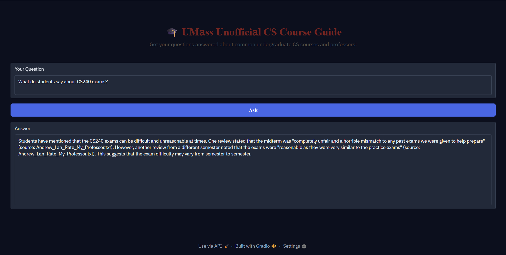

# The Unofficial Guide — Project 1

---

## Domain

<!-- What topic or category of knowledge does your system cover?
     Why is this knowledge valuable, and why is it hard to find through official channels?
     Example: "Student reviews of CS professors at [university] — useful because official
     course descriptions don't reflect teaching style, exam difficulty, or workload." -->

**Domain**: My chosen domain is course and professor reviews of the Computer Science Department at UMass Amherst,
focused on the four required 200-level courses: CS210, CS220, CS230, and CS240.

**Use Case**: These 200-level courses are taught by various professors with different sections, so knowing the
ratings and comments of the professors who frequently teach them can help students make informed decisions
for course registration and which professor to take the desired course with.

---

## Document Sources

<!-- List every source you collected documents from.
     Be specific: include URLs, subreddit names, forum thread titles, or file names.
     Aim for variety — sources that together cover different subtopics or perspectives. -->

| # | Source | Type | URL or file path |
|---|--------|------|-----------------|
| 1 | Rate My Professor: Andrew Lan | extracted into text file | https://www.ratemyprofessors.com/professor/2445013; extracted text into file 'Andrew_Lan_Rate_My_Professor.txt' |
| 2 | COMPSCI 250 Home Page Spring 2026 | extracted into text file |https://people.cs.umass.edu/~barring/cs250/; extracted text into file 'COMPSCI_250_Home_Page_Spring_2026.txt' |
| 3 | Coursicle CS240 at UMass Amherst Overview Page | extracted into text file | https://www.coursicle.com/umass/courses/COMPSCI/240/; extracted into file 'Coursicle_COMPSCI_240_at_UMass_Website.txt' |
| 4 | CS220 Fall 2025 Course Page | extracted into text file | https://people.cs.umass.edu/~jaimedavila/Courses/220/; extracted into file 'CS220_Fall_2025_Course_Page.txt' |
| 5 | Rate My Professor: David Barrington | extracted into text file | https://www.ratemyprofessors.com/professor/82723; extracted text into file 'David_Barrington_Rate_My_Professor.txt' |
| 6 | Rate My Professor: Jaime Davila | extracted into text file | https://www.ratemyprofessors.com/professor/2596812; extracted text into file 'Jaime_Davila_Rate_My_Professor.txt' |
| 7 | Rate My Professor: Joe Chiu | extracted into text file | https://www.ratemyprofessors.com/professor/2420066; extracted text into file 'Joe_Chiu_Rate_My_Professor.txt' |
| 8 | Rate My Professor: Marius Minea | extracted into text file | https://www.ratemyprofessors.com/professor/2416008; extracted text into file 'Marius_Minea_Rate_My_Professor.txt' |
| 9 | Rate My Professor: Mordecai Golin | extracted into text file | https://www.ratemyprofessors.com/professor/2940693; extracted text into file 'Mordecai_Golin_Rate_My_Professor.txt' |
| 10 | Rate My Professor: Phuthipong Bovornkeeratiroj| extracted into text file | https://www.ratemyprofessors.com/professor/2992114; extracted text into file 'Phuthipong_Bovornkeeratiroj_Rate_My_Professor.txt' |
| 11 | r/umass subreddit post titled 'cs 230 and 250' by user SeatAgile1918 | extracted into text file | https://www.reddit.com/r/umass/comments/1orfe6z/cs_230_and_250/; extracted text into file 'umass_subreddit_post_cs_230_and_cs_250.txt' |

**Note on Rate My Professor Text Extraction**: 
For the Rate My Professor text files, only select reviews were extracted, since these professors also teach upper-level courses
which is not the primary focus of the stated domain above. Older reviews from multiple semesters ago were also minimized or excluded
since the information might not be relevant for upcoming semesters.

---

## Chunking Strategy

<!-- Describe your chunking approach with enough specificity that someone else could reproduce it.
     Include:
     - Chunk size (characters or tokens) and why that size fits your documents
     - Overlap size and why (or why not) you used overlap
     - Any preprocessing you did before chunking (e.g., stripping HTML, removing headers)
     - What your final chunk count was across all documents -->

I have two overall categories of documents:
- Rate My Professor text files, where each review is marked by `-- REVIEW START --` and `-- REVIEW END --`
- Other longer text files, such as course pages/syllabi, Coursicle descriptions, and subreddit comments and replies

I have a different chunking strategy for each general category.

#### Rate My Professor Reviews
- Each review will be kept together as one chunk, to prevent context from being lost if review text is split across two chunks via fixed chunk sizes.
- Each chunk will be the review text, along with the professor name, course number/ID, tags, and rating. This keeps each review as the smallest unit.

#### Other Documents
Use fixed size chunking, with a reasonable chunk size and overlap to account for the sentence and paragraph structure of course pages and comment threads.

**Chunk size:** 500 characters

**Overlap:** 70 characters

**Minimum Length:** 50 characters

**Why these choices fit your documents:** Unlike the Rate My Professor reviews, the remaining documents do not have clear structure or specific start and stop points. A fixed chunk size of 500 characters is enough to capture a couple sentences, which is ideal since course pages often have related info (such as prerequisites or grading) together in adjacent sentences. 

An overlap of 70 characters will ensure that sentences are not split across multiple chunks, preserving the ending or starting phrases of a sentence in one or more chunks.

**Final chunk count:** 112 chunks from 11 documents

---

## Five Sample Chunks

#### Chunk 1

**Chunk ID:** compsci_250_home_page_spring_2026_8

**Source:** COMPSCI_250_Home_Page_Spring_2026.txt

**Text:** 
rchangeable as we can make them.

The textbook is the first edition of Dave's in-progress book, A Mathematical Foundation for Computer Science. This will be available as an e-book from Kendall Hunt Publishing, with ISBN number 9798385192830. Do not buy the "Revised Preliminary Edition", as it will not include the correct assessment package. At least last semester, buying the book directly from Kendall Hunt was considerably cheaper than using eCampus.

The book has an "assessment package" where y

#### Chunk 2

**Chunk ID:** marius_minea_rate_my_professor_8

**Source:** Marius_Minea_Rate_My_Professor.txt

**Text:** 
Professor: Marius Minea
Course: CS220
Date: May 13th, 2025
Quality: 2.0
Difficulty: 4.0

For Credit: Yes
Attendance: Mandatory
Textbook: N/A

Review: I get it, the guy is caring. However, he is not a great teacher. There is more words on a single slide than the entire book of Genesis. Along with that, next to know live code. It is paying credits for a podcast. I just think he is someone who cares and tries, but his own intelligence holds him back from being a good professor.

#### Chunk 3

**Chunk ID:** umass_subreddit_post_cs_230_and_cs_250_2

**Source:** umass_subreddit_post_cs_230_and_cs_250.txt

**Text:** 
d.

Don't procrastinate on the homeworks though. For 230, but especially for cs250. For 250, they take on the lower side around 4 hours at least. And if you want the extra credit for LaTeX formatting, that'll take some extra time. They give you one week for a reason.

I personally don't think it would be too difficult taking all three together. I'm currently struggling, but that's mainly because I overloaded to take an extra higher level math course which turned out to be a lot harder than I ant

#### Chunk 4

**Chunk ID:** phuthipong_bovornkeeratiroj_rate_my_professor_5

**Source:** Phuthipong_Bovornkeeratiroj_Rate_My_Professor.txt

**Text:** 
Professor: Phuthipong Bovornkeeratiroj
Course: CS230
Date: May 16th, 2025
Quality: 3.0
Difficulty: 3.0

For Credit: Yes
Attendance: Not Mandatory
Would Take Again: Yes
Grade: A-
Textbook: N/A

Review: Nikko is an extremely personable and genuine guy. I liked how he incorporated memes into his slides and tried to dumb the content down, but I felt like the lectures were not really that engaging. The project documentation isn't great. The exams are generously graded. I don't like that the only extra credit relied on other ppl to answer survey.

#### Chunk 5

**Chunk ID:** compsci_250_home_page_spring_2026_11

**Source:** COMPSCI_250_Home_Page_Spring_2026.txt

**Text:** 
s for the Course
Lecture Slides from Spring 2014
Exam Directory (with all three exams and solutions)
Exam Directory from Fall 2023
Exam Directory from Spring 2024
Exam Directory from Fall 2024
Exam Directory from Spring 2025
Exam Directory from Fall 2025
Detailed Schedule (Lectures, Discussion, HW)
Piazza main page for the course (not set up yet)
Announcements (29 January 2026):

(8 Jan) The preliminary course page is going up today. Not much is changing from the Fall 2025 offering of the course

---

## Embedding Model

<!-- Name the embedding model you used and explain your choice.
     Then answer: if you were deploying this system for real users and cost wasn't a constraint,
     what tradeoffs would you weigh in choosing a different model?
     Consider: context length limits, multilingual support, accuracy on domain-specific text,
     latency, and local vs. API-hosted. -->

**Model used:** all-MiniLM-L6-v2 via sentence-transformers

This model is small and can be run locally in memory with no cost for external APIs or extensive hardware capabilities.

**Production tradeoff reflection:**
The all-MiniLM-L6-v2 is a good choice for this project since it can be run locally at no cost. However, it does have a limited context window. If cost was not a constraint, choosing an embedding model with a larger context window would allow the RAG pipeline to be flexible with chunk sizes, if larger documents are included later on.

Although my chosen domain does not contain very specific text and the documents are in English, multilingual support would become helpful if this pipeline were applied to international schools, allowing for a greater variety of sources.

Certain sources such as reviews and Reddit might use more slang and informal communication, which might not be handled well by older embedding models.

Although latency would increase for larger and more state of the art embedding models, chunking does not have to be repeated too often, depending on how much the document base changes or is updated.

---

## Retrieval Approach

**Top-k:** 5

A top-k of 5 allows for multiple reviews to be pulled from. Since student reviews are subjective, having multiple chunks instead of just 2 or 3 will help the LLM provide
a more well-rounded answer. However, going above a top-k of 5 leads the risk of loosely-related chunks being passed on to the generation stage and the LLM.

Cosine similarity is used as the distance metric via ChromaDB, since it is a strong measure of similarity, and might perform better for chunks of various sizes, while other measures like Manhattan distance tend to increase as the embedding vector dimensions or noise increases.

No manual filtering was performed on the chunks after ChromaDB was queried with the provided student question, since I didn't want to run the risk of passing on too few chunks to the LLM, which could result in a potentially biased answer.

---

## Three Retrieval Test Results

#### Result 1
**Query**: What do students say about Andrew Lan's lectures?

**Retrieved (Top 5) Chunks:**

*#1*
[dist: 0.291] (source: Andrew_Lan_Rate_My_Professor.txt)
 Professor: Andrew Lan
Course: CS240
Date: Dec 14th, 2025
Quality: 1.0
Difficulty: 5.0

For Credit: Yes
Attendance: Not Mandatory
Grade: Not sure yet

Review: Andrew Lan's section covers strictly more material than Parvini's. The midterm was also significantly harder than past semesters, making practice materials useless. Lectures are dry, and assignments are just PDFs/Canvas quizzes, leaving no room for error and forcing you to compare answers. The only highlights are his humor and a generous curve.

*#2*
[dist: 0.359] (source: Andrew_Lan_Rate_My_Professor.txt)
 Professor: Andrew Lan
Course: CS240
Date: Dec 17th, 2025
Quality: 1.0
Difficulty: 4.0

For Credit: Yes
Attendance: Not Mandatory
Textbook: N/A

Review: His lecture is boring and harder than it needs to be.

*#3*
[dist: 0.370] (source: Andrew_Lan_Rate_My_Professor.txt)
 Professor: Andrew Lan
Course: CS240
Date: Dec 19th, 2025
Quality: 4.0
Difficulty: 3.0

For Credit: Yes
Attendance: Not Mandatory
Would Take Again: Yes
Grade: A
Textbook: N/A

Review: I think a math heavy course like CS 240 would be a lot better in small sections compared to large lectures. Still, I found Professor Lan to be quite solid. Although lectures can get quite dense somewhat monotonous, he's actually a pretty funny guy. He curves by standing(quite generously) and is still by far the better professor to take 240 with.
Tags: Lecture heavy, Test heavy, Graded by few things

*#4*
[dist: 0.375] (source: Andrew_Lan_Rate_My_Professor.txt)
 Professor: Andrew Lan
Course: CS240
Date: Jan 21st, 2026
Quality: 2.0
Difficulty: 5.0

For Credit: Yes
Attendance: Not Mandatory
Grade: A-
Textbook: Yes

Review: This class is dense despite Lan's dry and slow lectures. I had to put in an enormous effort into this course, and I had previously taken STAT315. Lan doesn't seem to care about the material and was the opposite of inspiring. The midterm was ridiculously hard and the homework grading is unforgiving. Not enough resources available to prepare.
Tags: Lots of homework, Test heavy

*#5*
[dist: 0.381] (source: Andrew_Lan_Rate_My_Professor.txt)
 Professor: Andrew Lan
Course: CS240
Date: Dec 9th, 2025
Quality: 1.0
Difficulty: 3.0

For Credit: Yes
Attendance: Not Mandatory
Textbook: N/A

Review: One of the most boring and monotonous lecturer I have ever encountered at this school. It seems like he is not even interested or passionate about teaching the class. How can someone make such an interesting topic like probability so boring to its core.

**Relevance:** All the retrieved chunks are from Professor Lan's Rate My Professor reviews, with low distance scores and mentions of the professor's characteristics and attitude towards the classes he teaches.

##### Result 2
**Query**: What is the workload for homeworks in CS250?

**Retrieved (Top 5) Chunks:**
*#1*
[dist: 0.350] (source: umass_subreddit_post_cs_230_and_cs_250.txt)
 d.

Don't procrastinate on the homeworks though. For 230, but especially for cs250. For 250, they take on the lower side around 4 hours at least. And if you want the extra credit for LaTeX formatting, that'll take some extra time. They give you one week for a reason.

I personally don't think it would be too difficult taking all three together. I'm currently struggling, but that's mainly because I overloaded to take an extra higher level math course which turned out to be a lot harder than I ant

*#2*
[dist: 0.437] (source: David_Barrington_Rate_My_Professor.txt)
 Professor: David Barrington
Course: COMPSCI250
Date: Feb 6th, 2024
Quality: 3.0
Difficulty: 5.0

For Credit: Yes
Attendance: Mandatory
Would Take Again: Yes
Textbook: N/A

Review: Dave is a great guy, but CS250 is an extremely tough class. You are expected to have a decent wealth of knowledge for the HWs and exams! If you have a photogenic memory or have a great memory then you will be fine. But if your attention span is short like mine then the only way to do well is to study from day 1 and learn and study everyday.
Tags: Lots of homework

*#3*
[dist: 0.502] (source: umass_subreddit_post_cs_230_and_cs_250.txt)
 0 with Meng-Chieh Chiu or Nikko Bovornkeeratiroj?
-- POST END --

-- COMMENT START --
I'm taking cs230 with Joe Chiu. Its a good class, his accent can be a bit difficult at times, but you can ask him to repeat or go slower. It's also meant to work either synchronous or asynchronous, so you don't need to attend, even for labs. They also have Ed for questions and whatnot. Nikko is new this semester, but I've heard he's also good.

Don't procrastinate on the homeworks though. For 230, but especial

*#4*
[dist: 0.526] (source: David_Barrington_Rate_My_Professor.txt)
 Professor: David Barrington
Course: CS250
Date: Jan 3rd, 2026
Quality: 5.0
Difficulty: 4.0

For Credit: Yes
Attendance: Mandatory
Would Take Again: Yes
Grade: A
Textbook: Yes

Review: Very content heavy class but doable if you put in a lot of time and effort. Some of the lectures are a little confusing and his handwriting is hard to read, but there is lots of support. HWs take a while and can be challenging, same with exams and quizzes. But everything in the class is scaled VERY generously and there's a ton of extra credit.
Tags: EXTRA CREDIT, Lots of homework

*#5*
[dist: 0.533] (source: Mordecai_Golin_Rate_My_Professor.txt)
 Professor: Mordecai Golin
Course: CS250
Date: Mar 31st, 2025
Quality: 4.0
Difficulty: 4.0

For Credit: Yes
Attendance: Mandatory
Would Take Again: Yes
Textbook: Yes

Review: The homework is a LOT and the material is not always the easiest, but he does a good job teaching the content. The lectures can feel a bit unfocused on occasion but they're usually well delivered and informative. Ultimately he does a very good job teaching, and the hard part of the class is the workload rather than understanding his lectures.
Tags: Lots of homework

**Relevance:** The retrieved chunks draw from Reddit threads where users discuss various courses including CS250 and advice for the homeworks. The remaining chunks are reviews related to professors who have taught CS250 before, such as David Barrington and Mordecai Golin. Multiple reviews mention the course homeworks along with other helpful details about the course.

#### Result 3
**Query:** How helpful is professor Marius Minea?

**Retrieved (Top 5) Chunks:**
*#1*
[dist: 0.306] (source: Marius_Minea_Rate_My_Professor.txt)
 Professor: Marius Minea
Course: COMPSCI220
Date: Nov 14th, 2025
Quality: 5.0
Difficulty: 1.0

For Credit: Yes
Attendance: Mandatory
Would Take Again: Yes
Grade: A
Textbook: N/A

Review: Let us indulge in a social experiment. Invite your friends and family to take CS220 with Marius. If anyone complains, they should be removed from your life. Marius is a pleasure, and it is disheartening to see others blame their own shortcomings on him. Name a more iconic duo than Marius and Max. Their 2024-2025 run was one for the history books!
Tags: Inspirational, Caring, Respected

*#2*
[dist: 0.354] (source: Marius_Minea_Rate_My_Professor.txt)
 Professor: Marius Minea
Course: COMPSCI311
Date: May 20th, 2025
Quality: 2.0
Difficulty: 4.0

For Credit: Yes
Attendance: Mandatory
Grade: Not sure yet
Textbook: Yes

Review: Marius is caring and easy to reach outside of class. He really tries to connect with his students. My issue lies with his lectures. His lectures contained significantly more material than the other class, and they were harder to understand. I had to read the other professor's slides and watch his recordings to understand the material.
Tags: Get ready to read, Caring, Accessible outside class

*#3*
[dist: 0.375] (source: Marius_Minea_Rate_My_Professor.txt)
 Professor: Marius Minea
Course: CS220
Date: May 13th, 2025
Quality: 5.0
Difficulty: 5.0

For Credit: Yes
Attendance: Mandatory
Would Take Again: Yes
Grade: B
Textbook: N/A

Review: Don't listen to anyone telling you to avoid Marius. You're at university to learn and be challenged right? Marius makes his class hard but he and his TA's do EVERYTHING to make sure students succeed. Amazing class.
Tags: Tough grader, Amazing lectures, Accessible outside class

*#4*
[dist: 0.385] (source: Marius_Minea_Rate_My_Professor.txt)
 Professor: Marius Minea
Course: CS220
Date: May 13th, 2025
Quality: 2.0
Difficulty: 4.0

For Credit: Yes
Attendance: Mandatory
Textbook: N/A

Review: I get it, the guy is caring. However, he is not a great teacher. There is more words on a single slide than the entire book of Genesis. Along with that, next to know live code. It is paying credits for a podcast. I just think he is someone who cares and tries, but his own intelligence holds him back from being a good professor.

*#5*
[dist: 0.421] (source: Marius_Minea_Rate_My_Professor.txt)
 Professor: Marius Minea
Course: COMPSCI220
Date: May 20th, 2025
Quality: 1.0
Difficulty: 5.0

For Credit: Yes
Attendance: Mandatory
Grade: B+
Textbook: N/A

Review: The only redeeming quality about him is that he responds to CampusWire quickly. He explains concepts in confusing ways. Quizzes and exams are unreasonably hard. Argues with students when they give him a suggestion for the class. I would avoid this professor at all costs.

**Relevance:** The retrieved chunks all draw from Professor Minea's Rate My Professor reviews, with relatively low distance scores. These reviews cover a wide range of student opinions involving both praise and criticism, allowing for a potentially well-rounded system response.

---

## Grounded Generation

<!-- Explain how your system enforces grounding — how does it prevent the LLM from answering
     beyond the retrieved documents?
     Describe both your system prompt (what instruction you gave the model) and any structural
     choices (e.g., how you formatted the context, whether you filtered low-relevance chunks).
     Do not just say "I told it to use the documents" — show the actual instruction or explain
     the mechanism. -->

**System prompt grounding instruction:**

The grounding and source attribution is enforced via the system prompt, which instructs the system prompt to answer only using the given chunks.

The entire system prompt is as follows:
> You are the unofficial UMass CS Course guide, with emphasis on the 200-level courses: CS/CICS 210, 220, 230, 240, and 250. You are best at answering real student questions about these courses, the professors that teach them, and the characteristics, positives, and negatives of these professors and the courses themselves. Your job is to answer user questions using ONLY the given chunks from student reviews and/or course pages and descriptions. If a user's question cannot be answered with the given chunks, tell the user that there doesn't seem to be relevant information for their question, and ask them to be more specific or provide further detail (in these cases, citations are not needed). Do not provide answers outside the scope of the given chunks. When answering, indicate the file name your answer is based on in parentheses in the form "(source: <filename>)", similar in usage to an MLA in-text citation. Don't include chunk numbers, however.

**How source attribution is surfaced in the response:**

Source attributions appear, as described in the system prompt, similar to an MLA in-text citation, with "(source: <filename>)" being added at the end of relevant sentences in the system response. For example, below is a sample system response for the query `What do students say about Jaime's lecturing style?`:
> Students have mentioned that Jaime's lectures can sometimes be unclear or dragged out, but he is always willing to clarify any questions and explain concepts clearly (source: Jaime_Davila_Rate_My_Professor.txt). One student noted that his lectures can "sometimes not make sense" but he would always clarify questions, while another student mentioned that lectures can "sometimes drag on" (source: Jaime_Davila_Rate_My_Professor.txt). Additionally, it's been mentioned that Jaime has an accent which can make him "slightly hard to understand" (source: Jaime_Davila_Rate_My_Professor.txt). Overall, students seem to appreciate Jaime's dedication to teaching and his ability to make the class reasonable, despite some minor issues with his lecturing style.

The filename is included in parentheses at the ends of the sentences where the response refers to the chunks from that file.

---

## Two Example Responses

#### Example 1
**Query:** How helpful is professor Marius Minea?

**System Response:**
Professor Marius Minea is described as caring and easy to reach outside of class, with one review stating that "he really tries to connect with his students" and another mentioning that "he responds to CampusWire quickly" (source: Marius_Minea_Rate_My_Professor.txt). Additionally, some reviews mention that he and his TA's "do EVERYTHING to make sure students succeed" (source: Marius_Minea_Rate_My_Professor.txt). However, other reviews criticize his teaching style, stating that his lectures can be confusing and that he argues with students when they give suggestions (source: Marius_Minea_Rate_My_Professor.txt). Overall, it seems that Professor Minea is helpful in terms of being accessible and responsive, but his effectiveness as a teacher is debated among students (source: Marius_Minea_Rate_My_Professor.txt).

#### Example 2
**Query:** What do students say about exams in CS240?

**System Response:**
Students have mixed reviews about exams in CS240. One review states that the midterm exam was "completely unfair and a horrible mismatch to any past exams" and that the class average on it was "abysmal" (source: Andrew_Lan_Rate_My_Professor.txt). However, another review from a different semester says that the exams were "reasonable" and "very similar to the practice exams" (source: Andrew_Lan_Rate_My_Professor.txt).

#### Example 3 (Out of Scope)

**Query:** Who are the best Chemical Engineering professors at UMass, according to students?

**System Response:**
There doesn't seem to be relevant information for your question. The provided chunks appear to be related to Computer Science professors and courses at UMass, but they do not mention Chemical Engineering professors. Could you please be more specific or provide further detail about your question? (source: various)

## Query Interface
The query interface is a simple Gradio UI, with a textbox for the user to enter a question and a button labeled "Ask" to generate a response. The generated response appears in the text field below the "Ask" button.

The screenshot below shows the UI and a sample query and answer.

## Evaluation Report

<!-- Run your 5 test questions from planning.md through your system and record the results.
     Be honest — a partially accurate or inaccurate result that you explain well is more
     valuable than a suspiciously perfect result. -->

| # | Question | Expected answer | System response (summarized) | Retrieval quality | Response accuracy |
|---|----------|-----------------|------------------------------|-------------------|-------------------|
| 1 |Who is the better professor to take CS250 with?  | Both David Barrington and Mordecai Golin have taught CS250 in recent semesters, and both have good reviews. Some students highlight Golin's helpful office hours and availability, while others note that Barrington's lectures might be a little confusing. However, regardless of the professor, the long homeworks and workload remain similar.  | The system response states that relevant information is not available for the question, and that the provided chunks do not answer the question. | Partially Relevant - chunks had low distance scores, but various professor reviews unrelated to CS250 were retrieved.| Inaccurate - The response does not provide any sort of helpful answer for a potential student. |
| 2 | I am not a great test-taker, which professors are known for having hard exams in the CS departments, and for what courses? | Professor Marius Minea is sometimes known for having difficult exams in CS220 and CS311, although students note he is a respected and passionate professor. Professor Andrew Lan is also noted for having harder midterms and/or finals for CS240, although a curve is typically applied.| The system response was that Andrew Lan's CS240 course, especially the midterm, is considered difficult. Additionally, CS250 with David Barrington is considered difficult and he might be a tough grader. | Relevant - The retrieved chunks had mentions of hard exams or courses, although chunks about Marius were not a part of them. | Partially Accurate - With the given chunks, the system response is correct, but it does fail to capture other exams, and it talks about CS250 as a difficult course, but not from a strict exam perspective. |
| 3 | Do I need to know multiple programming languages to succeed in CS220, due to the course's name of Programming Methodologies? | Although knowing multiple programming languages might help you feel more confident, the course is taught in JavaScript, so multiple languages are not strictly required. However, the general principles you learn in the course can be applied to a variety of programming languages. | The system response states that the course is taught in JavaScript and emphasizes general programming principles applicable to other languages. Therefore, knowing multiple languages is not necessary to succeed in CS220. | Partially relevant - The top related chunks came from the CS220 course page, although some unneeded chunks about other reviews that involve key words such as programming or the course number CS220 in a loosely-related context were also retrieved  | Accurate - The system response is similar to the expected answer, and directly pulls from the course details to answer the question. |
| 4 | What do students say about Jaime Davila's lecturing style? | Multiple students comment that Professor Davila's lectures can seem to start off slow, although he is patient and willing to answer questions. Some students note that he has a slight accent, but overall is a great professor who tries to keep lectures engaging and useful. | The system response states that students have mixed reviews about his lecturing style. Some students say he is good at explaining and clarifying concepts, and would always be open to questions. Other students mention that he might be slightly hard to understand (accent) and that sometimes his lectures can drag on. Overall, the professor puts effort into explaining concepts and answering questions to make the material understandable, even if his lecturing style might not work best for everyone.  | Relevant - The retrieved chunks were mostly Rate My Professor reviews about Jaime, and ones that mentioned his lectures and other characteristics. | Accurate - The system response draws from multiple reviews to provide a well-rounded answer, discussing the professor's ability to explain, while also including that his lecture style might not be universally liked. |
| 5 | How can I prepare for midterms and final exams in CS230? | Along with slides and lectures and doing the programming assignments, past exams and provided practice questions seem to be recommended by previous students as the better revision strategy. The exams you write will likely be similar to practice exams, drawing material from lecture slides and specific aspects of the homework projects. | The system response said that the chunks don't seem to contain relevant information for the question. | Off-target - Retrieved chunks mentioned exams or CS230 disjointly, and neither chunk mentioned exam preparation or overall course advice, located in Joe Chiu's Rate My Professor reviews. | Inaccurate - The system response is unable to provide a helpful answer. |

**Retrieval quality:** Relevant / ==Partially relevant== / Off-target  
**Response accuracy:** Accurate / ==Partially accurate== / Inaccurate

---

## Failure Case Analysis

<!-- Identify at least one question where retrieval or generation did not work as expected.
     Write a specific explanation of *why* it failed, tied to a part of the pipeline.

     "The answer was wrong" is not an explanation.

     "The relevant information was split across a chunk boundary, so retrieval returned
     only half the context — the model didn't have enough to answer correctly" is an explanation.

     "The embedding model treated the professor's nickname as out-of-vocabulary and returned
     results from an unrelated review" is an explanation. -->

**Question that failed:** How can I prepare for midterms and final exams in CS230? 

**What the system returned:** There doesn't seem to be relevant information for your question about preparing for midterms and final exams in CS 230. The provided chunks do not offer specific guidance on preparing for exams in CS 230. Could you provide more details or be more specific about what you're looking for? (source: umass_subreddit_post_cs_230_and_cs_250.txt)

**Root cause (tied to a specific pipeline stage):** The retrieval process is the main failure point, since the retrieved chunks were not relevant to the question. Various retrieved chunks did mention exams (typically from other courses), or overall discussion about CS230, but none of the retrieved chunks talked about how to prepare or study for the class. In Joe Chiu's Rate My Professor reviews, one of the reviews specifically states:

> "The lecture slides are mid at best and hard to understand without context. Go to labs and study the worksheets and Canvas quizzes for exams and you should be fine. There's also tons of office hours and SI." (source: Joe_Chiu_Rate_My_Professor.txt)

However, this review chunk was not part of the retrieved chunks, even though the course is CS230 and it discusses exam preparation tips. 

Interestingly, when I instead asked the question "How can I prepare for midterms and final exams in CS230 **with Joe Chiu**?", the relevant review quoted above is part of the retrieved chunks, and the resulting system response is helpful and specific. This suggests that the failed, original query has a lot of semantic similarity with other reviews and chunks, since exams and course preparation are very common discussion points in Rate My Professor reviews and Reddit threads. Therefore, picking the relevant chunks becomes more difficult, since better distinction needs to be made about which course and/or professor the retrieved chunks relate to.

**What you would change to fix it:** Providing extra metadata about the chunks aside from just filename might help. For example, tagging specifically by course number/ID and/or professor name would help in the retrieval step to filter out chunks that might be semantically similar but are actually about a different course or professor. In general, the use of better filtering in the retrieval step should help prevent the issue of semantically similar but topically different chunks being fed to the generation step.

---

## Spec Reflection

<!-- Reflect on how planning.md shaped your implementation.
     Answer both questions with at least 2–3 sentences each. -->

**One way the spec helped you during implementation:**
The spec was helpful during implementation to provide as input to Claude or some other model, which resulted in clearer
and specific code. For example, since my Architecture diagram and spec mentioned ChromaDB, when I passed the spec to Claude and prompted it to generate functions for the vector store and retrieval, it used code and naming conventions specific to ChromaDB, rather than providing more generic boilerplate-style code.

As a result, I was able to focus more on prompting for explanations and understanding the overall pipeline, rather than getting stuck in implementation details and having to continuously followup with additional details.

**One way your implementation diverged from the spec, and why:**
My implementation diverged from the spec in terms of adding a minimum length to the fixed size chunking, in order to prevent
small fragments ending up as complete chunks. This was a change not directly pulled from my spec, and something that I added along the way. By having a structured spec, I was able to think as I went through the project in terms of potential missing pieces or useful insertions. Without a spec written up, the code output from Claude would take more time to understand and tweak to my needs.

Another small deviation is that I did not use Gemini for explanation, and only used Claude since it already had the code and spec context, allowing it to better explain based off the questions I already asked.

---

## AI Usage

<!-- Describe at least 2 specific instances where you used an AI tool during this project.
     For each: what did you give the AI as input, what did it produce, and what did you
     change, override, or direct differently?

     "I used Claude to help me code" is not sufficient.
     "I gave Claude my Chunking Strategy section from planning.md and asked it to implement
     chunk_text(). It returned a function using a fixed character split. I overrode the
     chunk size from 500 to 200 because my documents are short reviews, not long guides." -->

**Instance 1**

- *What I gave the AI:* I gave Claude the Retrieval Approach section and the Architecture diagram from my planning.md, and asking it to implement the embedding and retrieval functions.
- *What it produced:* It produced an initial draft of the code in embed_and_retrieve_functions.py.
- *What I changed or overrode:* I changed how the embedding model was dealt with. Initially, the generated code loaded the model separately, and I instead prompted Claude to change the code so that the embedding model would be taken care of by ChromaDB's utils, which made the code cleaner and more understandable. I then asked it to add a small testing section if the file was run, so that I could verify the retrieved chunks for a given query in the terminal.

**Instance 2**

- *What I gave the AI:* I gave Claude the sample Gradio UI starter code from the project instructions, and my domain from the spec, and asked it to style the UI in accordance with my needs.
- *What it produced:* It produced the code related to the Gradio UI in app.py, including the layout and theming.
- *What I changed or overrode:* I added in the chat and pipeline setup functions in app.py, rather than following Claude's suggestion of placing such code elsewhere.
