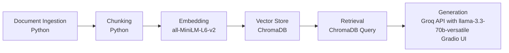

# Project 1 Planning: The Unofficial Guide

> Write this document before you write any pipeline code.
> Your spec and architecture diagram are what you'll use to direct AI tools (Claude, Copilot, etc.) to generate your implementation — the more specific they are, the more useful the generated code will be.
> Update the Retrieval Approach and Chunking Strategy sections if you change your approach during implementation.
> Update this file before starting any stretch features.

---

## Domain

<!-- What domain did you choose? Why is this knowledge valuable and hard to find through official channels? -->

**Domain**: My chosen domain is course and professor reviews of the Computer Science Department at UMass Amherst,
focused on the four required 200-level courses: CS210, CS220, CS230, and CS240.

**Use Case**: These 200-level courses are taught by various professors with different sections, so knowing the
ratings and comments of the professors who frequently teach them can help students make informed decisions
for course registration and which professor to take the desired course with.

---

## Documents

<!-- List your specific sources: URLs, subreddit names, forum threads, or file descriptions.
     Aim for at least 10 sources that together cover different subtopics or perspectives within your domain. -->

| # | Source | Type | URL or file path |
|---|--------|------|-----------------|
| 1 | Rate My Professor: Andrew Lan | extracted into text file | https://www.ratemyprofessors.com/professor/2445013; extracted text into file 'Andrew_Lan_Rate_My_Professor.txt' |
| 2 | COMPSCI 250 Home Page Spring 2026 | extracted into text file |https://people.cs.umass.edu/~barring/cs250/; extracted text into file 'COMPSCI_250_Home_Page_Spring_2026.txt' |
| 3 | Coursicle CS240 at UMass Amherst Overview Page | extracted into text file | https://www.coursicle.com/umass/courses/COMPSCI/240/; extracted into file 'Coursicle_COMPSCI_240_at_UMass_Website.txt' |
| 4 | CS220 Fall 2025 Course Page | extracted into text file | https://people.cs.umass.edu/~jaimedavila/Courses/220/; extracted into file 'CS220_Fall_2025_Course_Page.txt' |
| 5 | Rate My Professor: David Barrington | extracted into text file | https://www.ratemyprofessors.com/professor/82723; extracted text into file 'David_Barrington_Rate_My_Professor.txt' |
| 6 | Rate My Professor: Jaime Davila | extracted into text file | https://www.ratemyprofessors.com/professor/2596812; extracted text into file 'Jaime_Davila_Rate_My_Professor.txt' |
| 7 | Rate My Professor: Joe Chiu | extracted into text file | https://www.ratemyprofessors.com/professor/2420066; extracted text into file 'Joe_Chiu_Rate_My_Professor.txt' |
| 8 | Rate My Professor: Marius Minea | extracted into text file | https://www.ratemyprofessors.com/professor/2416008; extracted text into file 'Marius_Minea_Rate_My_Professor.txt' |
| 9 | Rate My Professor: Mordecai Golin | extracted into text file | https://www.ratemyprofessors.com/professor/2940693; extracted text into file 'Mordecai_Golin_Rate_My_Professor.txt' |
| 10 | Rate My Professor: Phuthipong Bovornkeeratiroj| extracted into text file | https://www.ratemyprofessors.com/professor/2992114; extracted text into file 'Phuthipong_Bovornkeeratiroj_Rate_My_Professor.txt' |
| 11 | r/umass subreddit post titled 'cs 230 and 250' by user SeatAgile1918 | extracted into text file | https://www.reddit.com/r/umass/comments/1orfe6z/cs_230_and_250/; extracted text into file 'umass_subreddit_post_cs_230_and_cs_250.txt' |

**Note on Rate My Professor Text Extraction**: For the Rate My Professor text files, only select reviews were extracted, since these professors also teach upper-level courses
which is not the primary focus of the stated domain above. Older reviews from multiple semesters ago were also minimized or excluded
since the information might not be relevant for upcoming semesters. 

---

## Chunking Strategy

<!-- How will you split documents into chunks?
     State your chunk size (in tokens or characters), overlap size, and explain why those
     numbers fit the structure of your documents.
     A review-heavy corpus warrants different chunking than a long FAQ. -->

I have two overall categories of documents:
- Rate My Professor text files, where each review is marked by `-- REVIEW START --` and `-- REVIEW END --`
- Other longer text files, such as course pages/syllabi, Coursicle descriptions, and subreddits comments and replies

I will apply a different chunking strategy to each category.

#### Rate My Professor
- Each review will be kept together as one chunk, to prevent context from being lost if review text is split across two chunks via fixed chunk sizes.
- Each chunk will be the review text, along with the professor name, course number/ID, tags, and rating. This keeps each review as the smallest unit.

#### Other Documents
Use fixed size chunking, with a reasoanble chunk size and overlap to account for the sentence and paragraph structure of course pages and comment threads.

**Chunk size: ** 500 characters

**Overlap: ** 70 characters

**Reasoning:** Unlike the Rate My Professor reviews, the remaining documents do not have clear structure or specific start and stop points. A fixed chunk size of 500 characters is enough to capture a couple sentences, which is ideal since course pages often have related info (such as prerequisites or grading) together in adjacent sentences. 

An overlap of 70 characters will ensure that sentences are not split across multiple chunks, preserving the ending or starting phrases of a sentence in one or more chunks.

---

## Retrieval Approach

<!-- Which embedding model are you using (e.g., all-MiniLM-L6-v2 via sentence-transformers)?
     How many chunks will you retrieve per query (top-k)?
     If you were deploying this for real users and cost wasn't a constraint, what tradeoffs
     would you weigh in choosing a different embedding model — context length, multilingual
     support, accuracy on domain-specific text, latency? -->

**Embedding model:** all-MiniLM-L6-v2 via sentence-transformers

**Top-k:** 5 (to accommodate multiple reviews while still minimizing loosely-related chunks being retrieved)

**Production tradeoff reflection:**
The all-MiniLM-L6-v2 is a good choice for this project since it can be run locally at no cost. However, it does have a limited context window. If cost was not a constraint, choosing an embedding model with a larger context window would allow the RAG pipeline to be flexible with chunk sizes, if larger documents are included later on.

Although my chosen domain does not contain very specific text and the documents are in English, multilingual support would become helpful if this pipeline were applied to international schools, allowing for a greater variety of sources.

Certain sources such as reviews and Reddit might use more slang and informal communication, which might not be handled well by older embedding models.

Although latency would increase for larger and more state of the art embedding models, chunking does not have to be repeated too often, depending on how much the document base changes or is updated.

---

## Evaluation Plan

<!-- List your 5 test questions with their expected correct answers.
     Questions should be specific enough that you can judge whether the system's response
     is right or wrong. "What are good dining halls?" is too vague.
     "What do students say about wait times at [dining hall name] during lunch?" is testable. -->

| # | Question | Expected answer |
|---|----------|-----------------|
| 1 | Who is the better professor to take CS250 with? | Both David Barrington and Mordecai Golin have taught CS250 in recent semesters, and both have good reviews. Some students highlight Golin's helpful office hours and availability, while others note that Barrington's lectures might be a little confusing. However, regardless of the professor, the long homeworks and workload remain similar. |
| 2 | I am not a great test-taker, which professors are known for having hard exams in the CS departments, and for what courses? | Professor Marius Minea is sometimes known for having difficult exams in CS220 and CS311, although students note he is a respected and passionate professor. Professor Andrew Lan is also noted for having harder midterms and/or finals for CS240, although a curve is typically applied.|
| 3 | Do I need to know multiple programming languages to succeed in CS220, due to the course's name of Programming Methodologies? | Although knowing multiple programming languages might help you feel more confident, the course is taught in JavaScript, so multiple languages are not strictly required. However, the general principles you learn in the course can be applied to a variety of programming languages. |
| 4 | What do students say about Jaime Davila's lecturing style? | Multiple students comment that Professor Davila's lectures can seem to start off slow, although he is patient and willing to answer questions. Some students note that he has a slight accent, but overall is a great professor who tries to keep lectures engaging and useful. |
| 5 | How can I prepare for midterms and final exams in CS230? | Along with slides and lectures and doing the programming assignments, past exams and provided practice questions seem to be recommended by previous students as the better revision strategy. The exams you write will likely be similar to practice exams, drawing material from lecture slides and specific aspects of the homework projects. |

---

## Anticipated Challenges

<!-- What could go wrong? Name at least two specific risks with reasoning.
     Consider: noisy or inconsistent documents, missing source attribution, off-topic
     retrieval, chunks that split key information across boundaries. -->

1. Rate My Professor reviews are subjective, and since reviews were handpicked, there could be a sampling bias that impacts how well the final LLM response is. Reviews might contradict each other, or reviews might change over time due to changes in the course curriculum or format. For example, two different students having opposite views on a certain professor might lead to inconsistent retrieval or LLM responses.

2. Limited Document Base - Although I selected professors who typically teach certain courses, UMass Amherst is a relatively large university with various staff, lectures, and professors being assigned to multiple courses and swapped around. If a student were to ask information about a professor or course not covered in the small selection of 11 documents, the LLM responses will not be helpful.

---

## Architecture

<!-- Draw a diagram of your pipeline showing the five stages:
     Document Ingestion → Chunking → Embedding + Vector Store → Retrieval → Generation
     Label each stage with the tool or library you're using.
     You can use ASCII art, a Mermaid diagram, or embed a sketch as an image.
     You'll use this diagram as context when prompting AI tools to implement each stage. -->

---

## AI Tool Plan

<!-- For each part of the pipeline below, describe:
     - Which AI tool you plan to use (Claude, Copilot, ChatGPT, etc.)
     - What you'll give it as input (which sections of this planning.md, which requirements)
     - What you expect it to produce
     - How you'll verify the output matches your spec

     "I'll use AI to help me code" is not a plan.
     "I'll give Claude my Chunking Strategy section and ask it to implement chunk_text()
     with my specified chunk size and overlap" is a plan. -->

**Milestone 3 — Ingestion and chunking:**
- AI Tool: Claude and/or Gemini (Claude for code implementation, Gemini for explanation and clarification)
- Input: The Chunking Strategy section, and a sample document for Rate My Professor and Other, to get an idea of the layout; Can also provide schema for how I want the chunks stored. Use this to implement the ingestion and chunking part of the pipeline.
- Expected Output: Python functions for the ingestion and chunking, with descriptions of the outputs and an explanation.
- Verify: Run the code, print outputs, and read some sample chunks to ensure the approach worked
- Checking Against the Spec: Ensure that the chunking strategy specified is followed, and that no alterations are made to the chunking strategy

**Milestone 4 — Embedding and retrieval:**
- AI Tool: Claude and/or Gemini (Claude for code implementation, Gemini for explanation and clarification)
- Input: The Retrieval Approach section, along with the Architecture diagram and instructions to use ChromaDB in the Python implementation.
- Expected Output: Python functions that implement the embedding and retrieval for a given query, with clear output examples and explanations
- Verify: Run the code and examine retrieved chunks for example queries, ensuring that retrieved chunks are consistently relevant and contain the needed information. Verify that edge cases (such as no chunks retrieved) are handled gracefully.
- Checking Against the Spec: Check that the code uses the right top_k parameter and embedding model.

**Milestone 5 — Generation and interface:**
- AI Tool: Claude and/or Gemini (Claude for code implementation, Gemini for explanation and clarification)
- Input: The Architecture diagram and written explanation of how the UI should function, what the inputs are, and to use Groq API with the specified Llama 3.3 model for response generation
- Expected Output: Python function(s) that implement the generation step and a simple interface. 
- Verify: Run the code and test the interface, ensuring that responses are correct and follow the system prompt instructing it to use RAG instead of provided invalid answers outside the scope of the documents.
- Checking Against the Spec: Check that the interface is easy to use and the right tools are used as per the Architecture diagram.